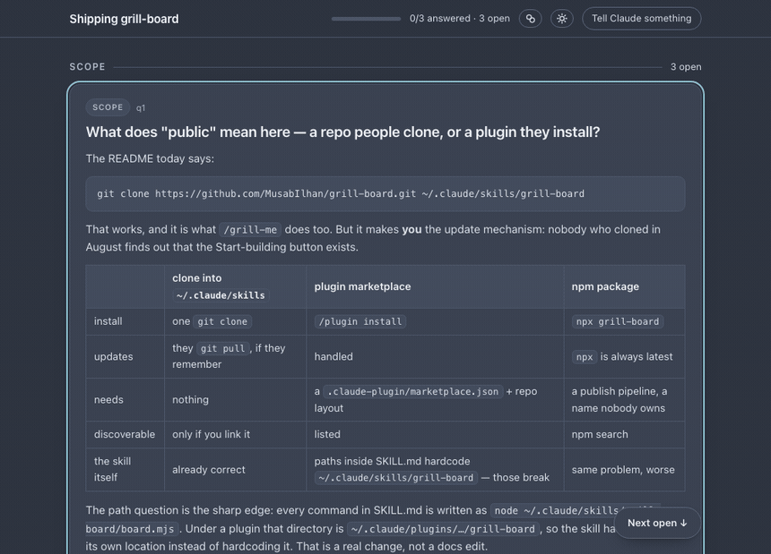

# grill-board

Answering an agent's questions one at a time is the slowest part of working with
one. It asks, you think, it waits. You answer, it thinks, you wait. And because
a chat line is small, the questions come out small too — so the ones that
actually decide the shape of the thing never get asked.

**grill-board puts them on a page instead.** Questions appear as cards on a
local web board you keep open. Answer whichever you like, in whatever order,
whenever — each answer wakes the session, which branches follow-ups into that
thread **while you carry on answering the others**. Nothing waits on anything.



*Three cards. You answer one, three more appear. The board drains, the plan goes
up and waits, and the steps tick over — [try the board yourself](https://musabilhan.github.io/grill-board/demo/),
it is the real page with a real grill frozen in it.*

```
seed a batch ──► you answer any card ──► the session wakes ──► it branches that thread
     ▲                   (never blocked)                                │
     └──────────────── new cards appear live ◄────────────────────────--┘
```

Because a card is a page and not a chat line, the question can carry what it
takes to answer it: the code, the tradeoff table, the two file paths, the number
that makes one option worse than the other.

**And it doesn't stop when the questions do.** The board drains, the plan goes
up, you press **Start building** — and every change comes back as a card with
the answers that caused it printed above the diff. Approve it, redirect it, or
reopen the decision it came from.

It works on a change as well as a plan. `/grill-board fix the retry loop`
diagnoses first, then asks about the **implementation forks** — fix the cause or
contain the symptom, change a shared function or fork it, this instance or the
class — with the actual code in each card. You end up in the code decision
instead of describing the bug.

Three things make it different from a chat prompt:

- **You are never blocked.** Questions queue on a board, not in the conversation.
- **Questions are roomy.** Each card renders full markdown — code, tables,
  tradeoffs — so everything needed to answer is *in* the question.
- **It doesn't end at agreement.** The board drains, the build appears on it
  step by step, and every change comes back as a card carrying the answers that
  produced it.

> If you have used [`/grill-me`](https://github.com/robmitt/grill-me-skill),
> this is its asynchronous sibling — same idea, except you are never the one
> waiting.

## Install

```bash
npx skills add MusabIlhan/grill-board
```

It asks which agent and whether to install globally or just here. Or clone it
straight in, which is the same thing without the questions:

```bash
git clone https://github.com/MusabIlhan/grill-board.git ~/.claude/skills/grill-board
```

Node 18+. No dependencies, nothing to build.

Then, in Claude Code:

```
/grill-board the sync model in this plan
```

It prints a `localhost` URL and a LAN one — the board answers fine from a phone.
Both carry a `?t=` token, because a board that listens on the network is
writable by whoever can reach it. `--host 127.0.0.1` keeps it on this machine
and drops the token; `--no-token` serves it open on a network you trust.

## Building, and reviewing what got built

A decision that never becomes code was a conversation, not an agreement. So the
board doesn't stop when the questions do.

When it drains, the plan goes up first — and stops there. **Nothing is built
until you press Start building.** The plan is a proposal until then: read it,
say cut that step, and it comes back rewritten. No command starts it and the
session is refused if it tries, so you cannot come back to a board and find the
thing you were about to read already half-built.

```
Here's the plan — 3 steps                          0/3
  ·  Split retryable vs terminal in classifyError   q1
  ·  Backfill the 41 stuck rows      waits on s1    q2
  ·  Regression test for a 401 in the outbox        q1

  [ Start building ]   Nothing is written until you press this.
```

Press it and the header flips to **building** — the same panel, steps ticking
over as they land, each showing which answers it came from. The board is never
blank while the session works.

It doesn't rely on being told, either. The moment the last card is answered the
board says so itself — *"nothing left to answer, Claude is reading your
answers"* — and once the build starts it keeps a running count of steps done
against changes actually sent back, so a build that is ticking off steps and
handing you nothing to look at says so instead of looking healthy. Settling the
last step sends the changes up on its own; a finished build cannot end in
silence.

```
Building what you decided                          2/4
  ✓  Split retryable vs terminal in classifyError   q1 q3
  ✓  Backfill the 41 stuck rows                        q2
  ◐  Regression test for a 401 in the outbox           q1
  ·  Re-test the other two classifyError callers       q3
```

### First, the things to go and try

A review asks whether the code *reads* right. Whether it *works* is a different
question, and only one of the two can be answered by looking at a diff. So the
build hands over a checklist before it hands over any code:

```
☑  A 401 stops instead of retrying forever          t1
☒  The dead-letter row keeps its original error     t2   ← doesn't work
☐  The other two callers still classify the same    t3
```

Each card says what to do, what should happen, and which change it covers. Three
answers: **works**, **doesn't work**, or **can't test now** — the last is the
deliberate way past something you genuinely cannot try, and it doesn't hold
anything up.

Saying it doesn't work is the useful case. Say what you saw, and that goes
straight to the session as the thing to fix — no round trip through "what
happened?", because the button asked for it up front. Once it's fixed the card
comes back at **attempt 2**, carrying what failed last time so retesting doesn't
start from scratch.

**A failure holds every review back.** The fix is going to rewrite the change,
and a verdict given on the version that didn't work would only have to be asked
for again. Clear the list and the review appears on its own — minted by the tick
that finished it, not by a session that has to wake up first.

### Then every change comes back as a card

Not a diff on its own — a diff with **the questions that caused it and the
answers you gave**, printed above it:

> **Because you decided**
> - **q1** A 4xx retries forever. Fix at the classifier or the queue?
>   → Split classifyError — *"yes but keep the cap too"*

Three answers: **looks right**, **change the code** (the decision stands, say
what to fix — it's rewritten and the card reopens at revision 2), or **wrong
call, reopen q1** (the code was faithful, the decision wasn't). Free text beats
the button: *"looks right, but rename that flag"* is a rewrite, not an approval.

Each answered question grows a `Built: c1` link, so a decision and its code are
one click apart in both directions. The same three keys, the same voice client,
the same board.

`export` then writes the record — every decision, what it produced, every change
with its diff and its verdict, and a **Tested** section covering what was tried
and what came back, including anything that failed before it passed. That last
part is what makes the record say the work was *used* rather than only agreed to.

## Several agents on one build

Past three or four independent steps, building them in a line is just slow. So
the board doubles as the work queue: agents **claim** steps off it.

```
Building what you decided — 3 agents               1/4
  ◐  Split retryable vs terminal in classifyError    outbox    q1 q3
  ·  Backfill the 41 stuck rows        waits on s1                q2
  ◐  Regression test for a 401 in the outbox         tests        q1

     outbox s1    tests s3    docs idle
```

A claim is exclusive — the pick and the mark happen inside the same lock as
every other write, so two agents racing for the last step cannot both win it. A
step declares what must finish before it (`needs`) and what it expects to touch
(`files`); the first gates the claim, the second warns when two live steps are
heading for the same file. Nothing is taken from a slow agent silently: you're
told who holds it and for how long, and `--steal` says so on the board.

Every change is signed, so *"why is it done that way"* has someone to ask. And
each agent keeps its own event cursor — so a **change the code** verdict wakes
exactly the agent that wrote that change, which is the one that still knows why.

**Every call a worker makes goes back on the board.** Fanning out is fast and
its real cost is that the lead gets a diff and no reasoning — the only way to
learn why the lemma match beat the surface match is to read the code and guess,
which costs more than the step did. So a worker records what it settled, as it
settles it:

```bash
node board.mjs build --state "$S" --as backfill --step s8 \
  --decided "Matched on (lemma, pos), not surface — two of three callers already normalise" \
  --flag "position is written from here; if the slot rules diverge the indices are wrong"
```

That reaches the lead **on the wake itself**, not as something to go and fetch:

```
[step] s8 done by backfill — Lexeme identity · c7 c8
    decided: Matched on (lemma, pos), not surface — two of three callers already normalise
    FLAG: position is written from here; if the slot rules diverge the indices are wrong
```

`decisions` gives the standing picture, and names any settled step that recorded
nothing — so the lead knows which ones it still has to read back rather than
finding out later. The same lines appear under the step on the board and on the
review card, because a call nobody was asked about is exactly what review is for.

## Answering

Everything works from the keyboard. Press <kbd>?</kbd> on the board for the list.

Navigation has two levels — the cards, and the choices inside one card.
**Up/down always moves. Right steps in, left steps back out.**

```
cards  ──→──  that card's choices  ──→──  typing your own
       ←──                         ←── esc
```

| | |
|---|---|
| <kbd>W</kbd> <kbd>S</kbd> / <kbd>↑</kbd> <kbd>↓</kbd> | Up and down, on whichever level you're on |
| <kbd>D</kbd> / <kbd>→</kbd> | Step in · <kbd>A</kbd> / <kbd>←</kbd> step out |
| <kbd>N</kbd> | Next unanswered |
| <kbd>1</kbd>–<kbd>9</kbd> | Pick a choice directly |
| <kbd>space</kbd> | Take the highlighted choice — from the card level, Claude's pick |
| <kbd>⌘↵</kbd> | Send — the same key on a choice as in the text |
| <kbd>↵</kbd> | Reopen an answered card |
| <kbd>C</kbd> <kbd>E</kbd> | Write your own · show Claude's take |
| <kbd>T</kbd> <kbd>I</kbd> <kbd>V</kbd> | Ask simpler · implications · perspective |
| <kbd>M</kbd> <kbd>L</kbd> <kbd>P</kbd> | Tell Claude something · light/dark · palette |

**Start building** is the one control with no letter key, on purpose — tab to it
and press space. A single keystroke that starts a build is the accident the
button exists to prevent.

Three ways to say **"I can't answer this yet"**, and they ask for different
things back. **Ask simpler** — too dense as written, so it gets re-said plainly
or split in two. **Implications** — you can read the options but not their
consequences, so each one comes back with what it commits you to. **Perspective**
— you lack the vantage point, so the question returns with what a decision like
this actually turns on.

None of them answers for you, and none drops the detail that made the question
decidable. The card is retired and re-asked.

A card you're merely passing over never shows a highlighted choice — a highlight
you didn't put there reads as a decision already made for you. Choices you move
through are provisional and vanish when you leave or start writing your own; one
you actually pick (space, a number, a click) stays, so "option 2, but…" works.

**Push back** is the one worth knowing about: it tells the session the *question*
is wrong, and it retires and re-asks rather than defending it.

Eight palettes ship (Gruvbox, Catppuccin, Nord, Solarized, Rosé Pine, Everforest,
Tokyo Night, GitHub), light and dark. All 16 combinations were contrast-audited:
every text pair clears WCAG AA, every glyph clears 3:1. Default is Nord dark; the
choice persists across boards.

## Answering out loud

The board is also an MCP server, so another session — one with a voice mode, on
your phone — can read the questions and record your answers. It talks; you talk
back; the grilling session keeps branching on your Mac.

**Set it up once.** The gateway is a long-lived front door that serves whichever
board is *currently* running, so the URL you register never goes stale:

```bash
node board.mjs gateway --token          # prints an MCP URL and a token
cloudflared tunnel --url http://localhost:7799   # or: ngrok http 7799
```

Register `https://…/mcp?t=<token>` once as a custom connector. Every `serve`
claims itself as the current board on startup, so from then on you just run
`/grill-board` as normal and the voice session picks it up — no re-registering,
no per-board configuration.

For a second session **on the same machine** there's no need for any of that:

```bash
node board.mjs mcp --state <path>       # MCP over stdio
```

Seven tools: `list_questions`, `read_question`, `answer`, `ask_better`,
`board_status`, plus `list_boards` / `use_board` for when several grills are
running at once. What makes it work is that **`answer` takes free text** — you
say *"the first one, but only if we log the discards"* and that sentence is
recorded verbatim. Nothing tries to match it to an option key; the grilling
session reads it exactly as it reads a typed note.

Each card carries a `spoken` line written for the ear — no file paths, no
tables. `read_question` returns the full detail for when you ask for it, so the
narrator never has to improvise from a code block.

This covers the review too: `board_status` reports the build as it happens, and
a review card's spoken detail is the change described in prose, never the diff.
You can approve, redirect or reopen a decision without looking at anything.

**The gateway always has a token**, whether you ask for one or not — unlike the
board, which decides by looking at what it binds to. It cannot do that here: it
binds loopback and is then *tunnelled*, and no address check can see a tunnel.
What sits behind that URL is not read-only either; `answer` and `ask_better` are
writable, so an open tunnel is a stranger answering your cards. `--no-token`
exists and says out loud not to tunnel it. Tokens are accepted as `?t=` or as a
bearer header.

The seam is the state file, not HTTP — so an answer given by voice wakes the
grilling session exactly as a keystroke does, and you can switch between phone
and keyboard mid-board without telling either one.

## If it doesn't work

| what you see | what it is |
|---|---|
| `grill-board needs Node 18 or newer` | exactly that. `nvm install 18`, or your package manager. Nothing else is required — no dependencies, nothing to build. |
| the URL has a `?t=…` on it | a board that binds past loopback mints a token, so the LAN link is not an open door. Keep the whole URL. `--host 127.0.0.1` for this machine only, `--no-token` to serve it open. |
| a link that worked yesterday now 401s | you restarted a board that had no token and it minted one. Re-copy the URL it printed; it is stable from then on. |
| the board opens but stays empty | usually right — Claude is still reading. If it lasts, check the session is alive; the state file keeps every answer either way. |
| macOS or Windows asks to allow incoming connections | the default bind is `0.0.0.0`, which is what lets you answer from a phone. Decline it and use `--host 127.0.0.1`. |
| `no free port in 7800-7859` | sixty boards, or something else on those ports. `--port N` picks one. |
| a command warns the server is older than `board.mjs` | you updated the skill under a running board. It prints the exact restart command; nothing is lost, the state file is the truth. |

Still stuck: the state file is plain JSON and holds every question, answer and
change. `node board.mjs status --state <path>` prints what it thinks is going on.

## How it works

A zero-dependency Node server and a single HTML page.

```
board.mjs      server + CLI (serve, add, new, watch, retire, note, status, export,
                             build, change, test, review, claim, release,
                             decisions, mcp, gateway)
board.html     the page
SKILL.md       the instructions Claude follows
test-build.sh  the build protocol, raced for real
```

State is one JSON file per board. The CLI writes questions into it, the page
polls for them, and `board.mjs watch` emits one line per answer — which Claude
Code's `Monitor` turns into a wake-up. Between wakes the session ends its turn,
so it costs nothing while you think.

**Why not a published Artifact?** An Artifact's CSP blocks every outbound
request, so the page could display questions but never send answers back. A
local server is what closes the loop.

Notes on the parts that are less obvious than they look:

- **Writes take an exclusive lock.** `serve` and `add` are issued together and
  the page answers while the session posts, so overlapping writers are routine.
  Read-modify-write alone silently loses one of them.
- **The queue.** At most 8 cards are open at once; the rest wait and promote as
  you answer, so a deep branch can't bury you.
- **Scroll anchoring.** The feed is rebuilt on every change and changes land
  *above* where you're reading — a card collapsing, a follow-up inserting. The
  card under your eyes is pinned and the difference absorbed into the scroll.

## Licence

MIT — see [LICENSE](LICENSE). Use it, fork it, ship it.

It comes as it is. I built this for my own work and put it up because it turned
out to be worth having; issues are open and I read them, but I make no promise
to answer or to keep anything stable. If you need it to stay put, fork it.
